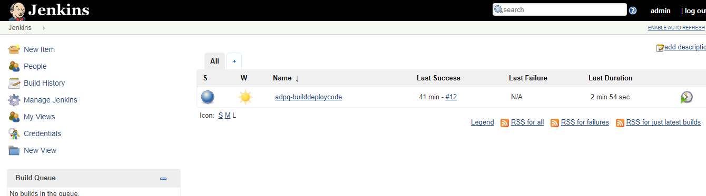
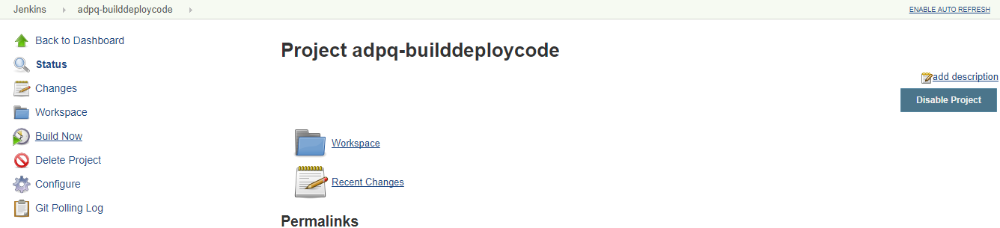

# ADPQ Infrastructure Configuration

The ADPQ infrastructure comprises of the following:
 *	Linux Ubuntu-16.04 LTS host machine on which Docker container will be running.
 *	Web Docker Container (where the application will be hosted)
 *	MongoDB Docker Container
 *	Jenkins Docker Container

There will be a Linux Ubuntu machine on which 3 docker containers will be running. The Web Container having Tomcat8 configured, will host the application. The MongoDB container will have the database configured on port 27017. The Jenkins container running at port 9010, will be having the web and MongoDB docker configuration job, and the front end & back end build and deploy job.

To setup the infrastructure, follow the below mentioned procedure.

1.	SSH into the Linux Ubuntu-16.04 LTS machine.

2.	Clone the Github repository into a particular directory. The cloned repository consists of the shell script which will configure docker on the host machine and other related packages. Open the terminal on the machine and run the below mentioned command.

### git clone https://github.com/InTimeTec-LLC/kmt-prototype.git
3.	Move into the clone directory.

### cd kmt-prototype/devops/scripts

4.	Execute the shell script StartJenkinsContainer.sh with passing the parameter as shown below. The parameter represents the custom Jenkins docker container tag. If executable rights are not provided for the shell, then the same can be provided by executing the command chmod +x StartJenkinsContainer.sh

### ./StartJenkinsContainer.sh latest_1.7

Upon execution of the above mentioned script, the required packages would be installed on the host machine and Jenkins will be configured running on port 9010. Jenkins can be accessed using the url:

### http://IP_Address_Of_The_Host_Machine:9010

Open the Jenkins console using the url mentioned above in any browser. The login credentials are mentioned below:

User: admin

Password: admin

The Jenkins console will open with the deployment job already created as shown below:

 

Click on the job name and then click Build Now.

The execution of the Jenkins job will begin. This Jenkins job will check whether the web and Mongo docker container are running on the Ubuntu host machine or not. If not, then it will configure the docker containers on the Ubuntu host machine. This job will also take the pull of the code repository from GitHub and will start to build & deploy the code.

After the execution of the above job, the application will be hosted on the web docker container and can be accessed using the IP address of the host machine.

### http://IP_Address_Of_The_Host_Machine

